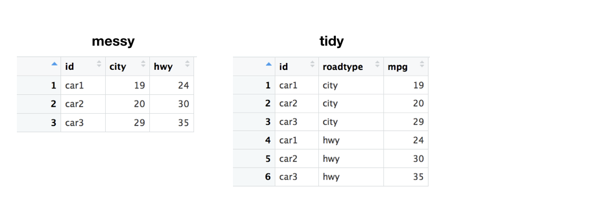
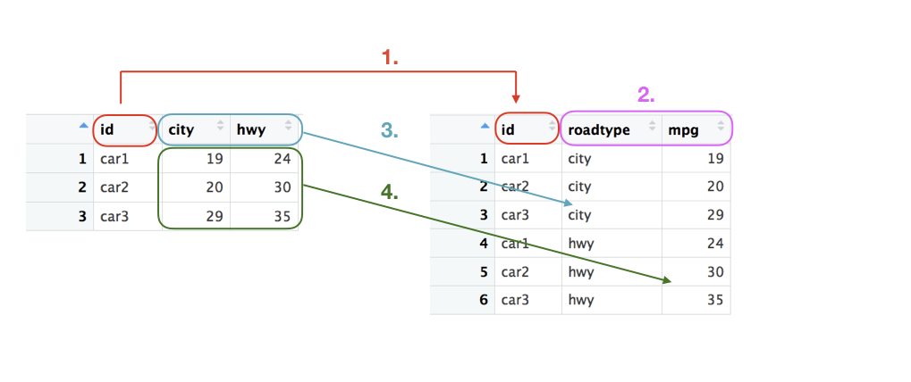
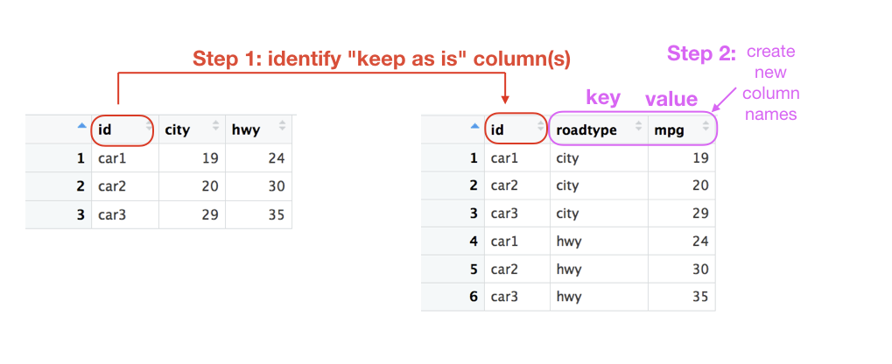
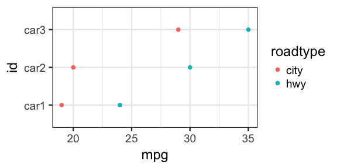
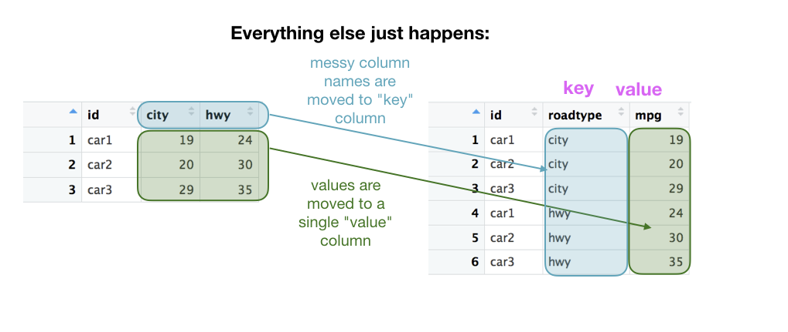

Using `tidyr::gather()` to tidy data
================
Joyce Robbins
1/31/2018

This tutorial focuses on one function: `tidyr::gather()`, which is used to convert data from messy to tidy. I won't get into the distinction here; I'm going to assume that you know that you know the terms; you just need help figuring how to get from one to the other. If, however, this is all new to you, I suggest reading ["Tidy Data"](https://www.jstatsoft.org/article/view/v059i10) by Hadley Wickham, the seminal paper on the topic which lays out the concept in detail.

### Observe

Before getting into the nitty-gritty of `gather()` let's study what our messy data looks like, and what it will look like when it's tidied:



Study the differences carefully. What did you observe? <br> <br> <br> Hopefully you noticed the following:

1.  The `id` column appears in both versions, though it's double the length in the tidy form.

2.  The `city` and `hwy` column names became the contents of the new `roadtype` column.

3.  The *values* of the `city` and `hwy` columns became the *values* of the new `mpg` column.

4.  As already noted, we have two new columns: `roadtype` and `mgp`, while `city` and `hwy` as columns are gone.



### Plan

The first step before coding this transformation is to divide the columns in the messy data set into two groups: those that we want to "keep as is", and those that we want to "dump" into the key column. The ones to "dump" are the ones that aren't true variables but in fact are *levels* of another variable. In this case, `city` and `hwy` should be levels of a new variable called `roadtype` (or something similar), according to the theory of tidy data. On the other hand, `id` should remain as is.

The second (and final) step is to choose names for the new *key* and *value* columns. We've already chosen `roadtype` for *key*; let's pick `mpg` for *value*. You can also choose to stick with the defaults for the new *key* and *value* column names: `key` and `value` (surprise). Using `key` and `value` may be helpful at first to keep track of which is which, though ultimately I find more descriptive names to be more useful.



### Code

The code to carry out the transformation from messy to tidy is one call to `gather()`:

``` r
tidydata <- messydata %>% 
  gather(key = "roadtype",  value = "mpg", -id)
```

Let's consider the three parameters separately since they're not completely intuitive.

`key = "roadtype"` sounds like it's setting the *key* to a preexisting column called "roadtype", but that's not what's going on. Rather, think of this as an instruction to *create a new key column and call it "roadtype").*

`value = "mpg"` likewise is an instruction to *create a new value column and call it "mpg".*

`-id` is the piece that says "Don't touch my `id` column! Leave it as is!"

Nothing else needs to be specified: it is "understood" that every value in a column isn't marked "don't touch" should be moved to the *value* ("mpg") column, paired with its old column name (in this case "city" or "hwy") from the messy data set, which now appears in the *key* column.

### Troubleshooting

There are a few problems I've seen with the way in which people use `gather()`:

1.  *Not separating the messy data columns properly into "keep" and "dump".*

In this case, the result will be something like the following:

``` r
messydata %>% gather(key = "roadtype", value = "mpg")
```

    ## # A tibble: 9 x 2
    ##   roadtype mpg  
    ##   <chr>    <chr>
    ## 1 id       car1 
    ## 2 id       car2 
    ## 3 id       car3 
    ## 4 city     19   
    ## 5 city     20   
    ## 6 city     29   
    ## 7 hwy      24   
    ## 8 hwy      30   
    ## 9 hwy      35

Yikes, not what we wanted. Looking at the "mpg" column, we see that "car1", "car2", and "car3" don't belong. The solution is to add the `-id` parameter.

Note: it is possible to specify the columns to *dump* rather then the columns to *keep*:

``` r
messydata %>% gather(key = "roadtype", value = "mpg", city, hwy)
```

    ## # A tibble: 6 x 3
    ##   id    roadtype   mpg
    ##   <chr> <chr>    <dbl>
    ## 1 car1  city      19.0
    ## 2 car2  city      20.0
    ## 3 car3  city      29.0
    ## 4 car1  hwy       24.0
    ## 5 car2  hwy       30.0
    ## 6 car3  hwy       35.0

I find this method less intuitive, but of course it's your choice.

1.  *Not adding an id column if one doesn't exist.*

Note in our example that the `id` column is important for linking the city and highway miles per gallon. For example, we might want to plot the data as follows, which requires knowing which car had which city and highway mpg:



Often, however, there is no `id` column: it's not necessary since each row represents one item -- a car in this case. If we try to tidy messy data without an id, it looks like this:

 The problem is that we've lost the natural connection we had between city and highway for each car since the two values no longer reside in the same row. The solution here is to move the row names -- or row numbers in this case -- to a column to be used as an id:

``` r
messy2 %>% rownames_to_column("id") %>% 
  gather(key, value, -id)
```

    ## # A tibble: 6 x 3
    ##   id    key   value
    ##   <chr> <chr> <dbl>
    ## 1 1     city   19.0
    ## 2 2     city   20.0
    ## 3 3     city   29.0
    ## 4 1     hwy    24.0
    ## 5 2     hwy    30.0
    ## 6 3     hwy    35.0

Note that we must specify the "don't touch" id column that we just created. Also note that we used the default `key` and `value` column names rather than choose our own.

1.  *Leaving out `key` and `value`*

I don't know if this issue is as widespread as the others, but I'm going to include it since I've made this mistake one too many times. Working on the assumption that you can leave out parameters if you're don't change the defaults, if you're like me, you might try something like this:

``` r
messydata %>% gather(-id)
```

    ## # A tibble: 9 x 2
    ##   `-id` value
    ##   <chr> <chr>
    ## 1 id    car1 
    ## 2 id    car2 
    ## 3 id    car3 
    ## 4 city  19   
    ## 5 city  20   
    ## 6 city  29   
    ## 7 hwy   24   
    ## 8 hwy   30   
    ## 9 hwy   35

The result is that no columns are spared, and the *key* column is now called "-id". Not what we wanted. Remember `key` and `value`, if you don't change the column names!

``` r
messydata %>% gather(key, value, -id)
```

    ## # A tibble: 6 x 3
    ##   id    key   value
    ##   <chr> <chr> <dbl>
    ## 1 car1  city   19.0
    ## 2 car2  city   20.0
    ## 3 car3  city   29.0
    ## 4 car1  hwy    24.0
    ## 5 car2  hwy    30.0
    ## 6 car3  hwy    35.0

Challenge: Take the `painters` dataset from the **MASS** package and tidy it into four columns as such:

``` r
head(tidypaint)
```

    ##            Name School       Skill Score
    ## 1      Da Udine      A Composition    10
    ## 2      Da Vinci      A Composition    15
    ## 3    Del Piombo      A Composition     8
    ## 4     Del Sarto      A Composition    12
    ## 5     Fr. Penni      A Composition     0
    ## 6 Guilio Romano      A Composition    15

[Solution](Solution1.md)
