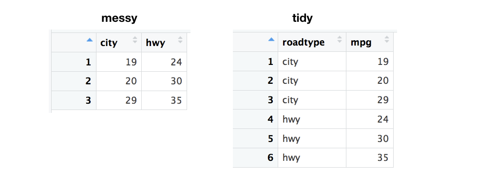
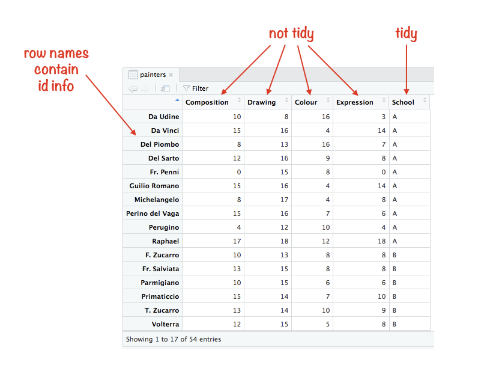
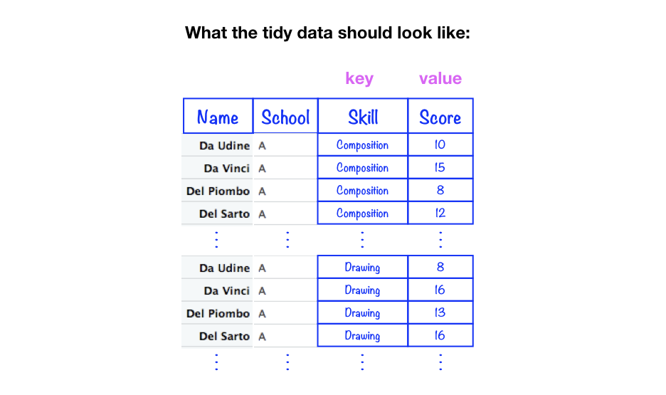
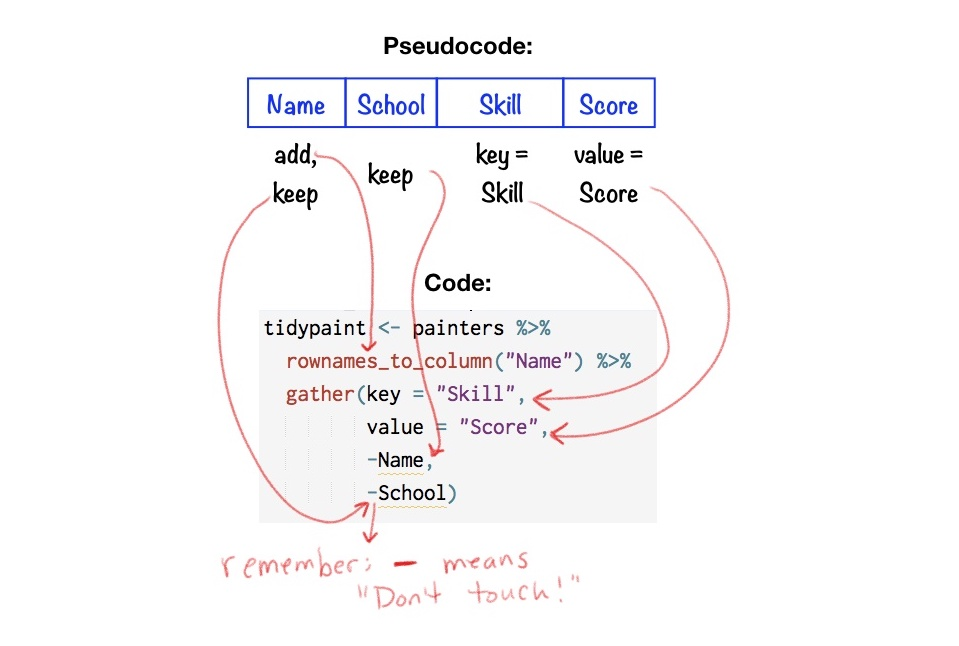

Using `tidyr::gather()` to tidy data
================
Joyce Robbins
originally published: 1/31/2018, last update: 2/3/2018

-   [Example 1: City vs. Highway](#example-1-city-vs.-highway)
    -   [Observe](#observe)
    -   [Plan](#plan)
    -   [Code](#code)
-   [Heads up](#heads-up)
    -   [Not separating the messy data columns properly into "keep" and "dump".](#not-separating-the-messy-data-columns-properly-into-keep-and-dump.)
    -   [Missing *id* column](#missing-id-column)
    -   [Leaving out `key` and `value`](#leaving-out-key-and-value)
-   [Example 2: `MASS::painters` dataset](#example-2-masspainters-dataset)
    -   [Observe](#observe-1)
    -   [Plan](#plan-1)
    -   [Code](#code-1)

This tutorial focuses on one function: `tidyr::gather()`, which is used to convert data from messy to tidy. I won't get into the distinction here -- I'm going to assume that you know the terms and just need help figuring how to get from A to B. If, however, this is all new to you, I suggest reading ["Tidy Data"](https://www.jstatsoft.org/article/view/v059i10) by Hadley Wickham, the seminal paper on the topic, which lays out the concept in detail.

Example 1: City vs. Highway
---------------------------

### Observe

Before getting into the nitty-gritty of `gather()` let's study what our messy data looks like, and what it will look like when it's tidied:


Study the differences carefully. What did you observe? <br> <br> <br> Hopefully you noticed the following:

1.  The `id` column appears in both versions, though it's double the length in the tidy form.

2.  We have two new columns: `roadtype` and `mpg`.

3.  The `city` and `hwy` column names became the contents of the new `roadtype` (*key*) column.

4.  The *values* of the `city` and `hwy` columns became the *values* of the new `mpg` (*value*) column.


### Plan

Now here's the trick: the only parts we need to concern ourselves with are 1. and 2.: deciding which columns to keep unchanged, and what names to give the new columns, which are called the *key* and *value* columns.

The columns to keep are the ones that are already tidy. The ones to dump are the ones that aren't true variables but in fact are *levels* of another variable. In this case, `city` and `hwy` should be levels of a new variable called `roadtype` (or something similar), according to the theory of tidy data. On the other hand, `id` should remain as is.

The bottom line: **keep `id` as is**


The second (and final) step is to choose names for the new *key* and *value* columns. We've already chosen `roadtype` for *key*; let's pick `mpg` for *value*. You can also choose to stick with the defaults for the new *key* and *value* column names: `key` and `value` (surprise). Using `key` and `value` may be helpful at first to keep track of which is which, though ultimately I find more descriptive names to be more useful.

The bottom line: **key = `roadtype`, value = `mpg`**


### Code

The code to carry out the transformation from messy to tidy is one call to `gather()`, with parameters that reflect our conclusions about the columns to keep and the names we've chosen:

``` r
tidydata <- messydata %>% 
  gather(key = "roadtype",  value = "mpg", -id)
```

The most important thing to note is that *each parameter corresponds to one of the columns in the tidy data set.*

Now let's look at them one at a time in more detail:

`key = "roadtype"` sounds like it's setting the *key* to a preexisting column called "roadtype", but that's not what's going on. Rather, think of this as an instruction to *create a new key column and call it "roadtype".*

`value = "mpg"` likewise is an instruction to *create a new value column and call it "mpg".*

`-id` is the piece that says "Don't touch my `id` column! Leave it as is!"

Nothing else needs to be specified: every value in a column not marked "don't touch" will be moved to the *value* ("mpg") column, paired with its old column name (in this case "city" or "hwy") from the messy data set, which now appears in the *key* column.

Heads up
--------

There are a few problems I've seen with the way in which people use `gather()`:

### Not separating the messy data columns properly into "keep" and "dump".

If we had made this mistake in the example above, the result would be something like:

``` r
messydata %>% gather(key = "roadtype", value = "mpg")
```

    ## # A tibble: 9 x 2
    ##   roadtype mpg  
    ##   <chr>    <chr>
    ## 1 id       car1 
    ## 2 id       car2 
    ## 3 id       car3 
    ## 4 city     19   
    ## 5 city     20   
    ## 6 city     29   
    ## 7 hwy      24   
    ## 8 hwy      30   
    ## 9 hwy      35

Yikes, not what we wanted. Looking at the `mpg` column, we see that "car1", "car2", and "car3" don't belong. The solution is to add the `-id` parameter -- remember, think: "don't touch `id`" -- so that it isn't "dumped" into the `key` column.

Note: it is possible to specify the columns to *dump* rather then the columns to *keep*:

``` r
messydata %>% gather(key = "roadtype", value = "mpg", city, hwy)
```

    ## # A tibble: 6 x 3
    ##   id    roadtype   mpg
    ##   <chr> <chr>    <dbl>
    ## 1 car1  city      19.0
    ## 2 car2  city      20.0
    ## 3 car3  city      29.0
    ## 4 car1  hwy       24.0
    ## 5 car2  hwy       30.0
    ## 6 car3  hwy       35.0

I find this method less intuitive, but of course it's your choice.

### Missing *id* column

Note in our example that the `id` column is important for linking the city and highway miles per gallon. For example, we might want to plot the data as follows, which requires knowing which car had which city and highway mpg:


Often, however, there is no `id` column: it's not necessary since each row represents one item -- a car in this case. If we try to tidy messy data without an id, it looks like this:



The problem is that we've lost the natural connection we had between city and highway for each car since the two values no longer reside in the same row. The solution here is to move the row names -- or row numbers in this case -- to a column to be used as an id:

``` r
messy2 %>% rownames_to_column("id") %>% 
  gather(key, value, -id)
```

    ## # A tibble: 6 x 3
    ##   id    key   value
    ##   <chr> <chr> <dbl>
    ## 1 1     city   19.0
    ## 2 2     city   20.0
    ## 3 3     city   29.0
    ## 4 1     hwy    24.0
    ## 5 2     hwy    30.0
    ## 6 3     hwy    35.0

Note that we must specify the "don't touch" id column that we just created. Also note that we used the default `key` and `value` column names rather than choose our own.

### Leaving out `key` and `value`

I don't know if this issue is as widespread as the others, but I'm going to include it since I've made this mistake one too many times. Working on the assumption that you can leave out parameters if you don't change the defaults, if you're like me, you might try something like this:

``` r
messydata %>% gather(-id)
```

    ## # A tibble: 9 x 2
    ##   `-id` value
    ##   <chr> <chr>
    ## 1 id    car1 
    ## 2 id    car2 
    ## 3 id    car3 
    ## 4 city  19   
    ## 5 city  20   
    ## 6 city  29   
    ## 7 hwy   24   
    ## 8 hwy   30   
    ## 9 hwy   35

The result is that no columns are spared, and the *key* column is now called "-id". Not what we wanted. Remember `key` and `value`, if you don't change the column names!

``` r
messydata %>% gather(key, value, -id)
```

    ## # A tibble: 6 x 3
    ##   id    key   value
    ##   <chr> <chr> <dbl>
    ## 1 car1  city   19.0
    ## 2 car2  city   20.0
    ## 3 car3  city   29.0
    ## 4 car1  hwy    24.0
    ## 5 car2  hwy    30.0
    ## 6 car3  hwy    35.0

Example 2: `MASS::painters` dataset
-----------------------------------

Let's take the `painters` dataset from the **MASS** package:

    ##               Composition Drawing Colour Expression School
    ## Da Udine               10       8     16          3      A
    ## Da Vinci               15      16      4         14      A
    ## Del Piombo              8      13     16          7      A
    ## Del Sarto              12      16      9          8      A
    ## Fr. Penni               0      15      8          0      A
    ## Guilio Romano          15      16      4         14      A

...and tidy it into four columns as such:

    ##            Name School       Skill Score
    ## 1      Da Udine      A Composition    10
    ## 2      Da Vinci      A Composition    15
    ## 3    Del Piombo      A Composition     8
    ## 4     Del Sarto      A Composition    12
    ## 5     Fr. Penni      A Composition     0
    ## 6 Guilio Romano      A Composition    15

This example is a little more complex than the previous one, since it's missing an *id* column, and there is more than one "keep" column. (You are encouraged to try this on your own before looking at the solution!)

### Observe



### Plan



-   Move rownames to a new column and call it `Name` (see "missing `id` column" in the **Heads up** section above to understand the need for this new column.)

-   Keep `Name` and `School` columns as is. ("Don't Touch!")

-   Since the four columns `Composition`, `Drawing`, `Colour`, and `Expression` are really levels of another variable, they do not get the "keep" as is designation. That means we are staging them to be dumped into a new *key* variable which we'll call `Skill`. In addition, the values contained in these columns will move to a new *value* column, which we'll call `Score`.

### Code

``` r
library(MASS)
library(tidyverse)
tidypaint <- painters %>% 
  rownames_to_column("Name") %>% 
  gather(key = "Skill", value = "Score", -Name, -School)
```

The breakdown:



Finally, if the visuals aren't your style, here's a running commentary of the instructions:

"Take the (messy) dataset `painters`. Move the contents of the rownames to a new column called `Name`. Now let's start tidying by gathering multiple columns into *key-value* pairs. Do this by creating a new *key* column called `Skill`. While you're at it, create a new *value* column called `Score`. Absolutely do not touch or change the `Name` and `School` columns (other than to replicate as necessary). It goes without saying that the four other column names will fill the new `Skill` column, and the values of those columns will fill the new `Score` column, since it's understood from what I've said already! Much appreciated!"

Thank you to [@angelotrivelli](https://twitter.com/angelotrivelli) [@dch4n](https://twitter.com/@dch4n) [@jschoeley](https://twitter.com/jschoeley) [@jspncr\_](https://twitter.com/jspncr_) [@kierisi](https://twitter.com/kierisi) [@s\_lump](https://twitter.com/s_lump) for providing feedback and helpful suggestions in response to [this Twitter post.](https://twitter.com/jtrnyc/status/958845845385940993)
