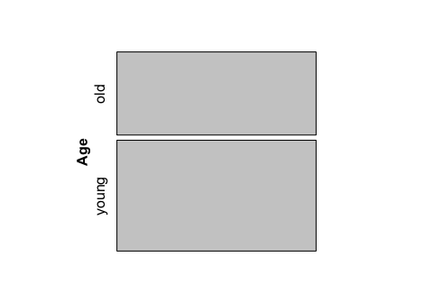
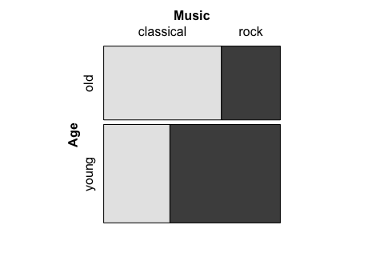
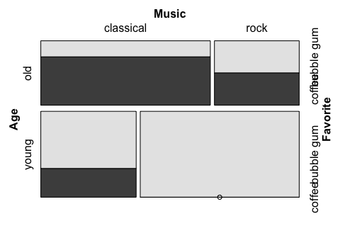
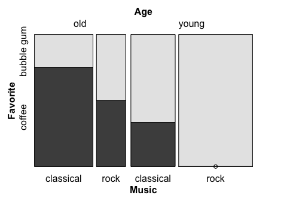
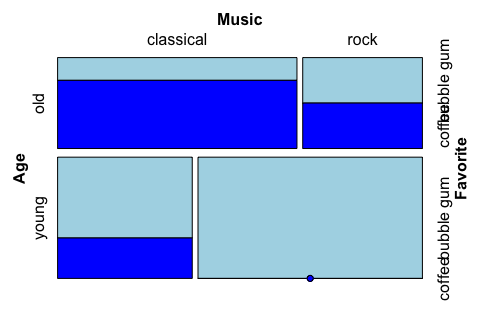
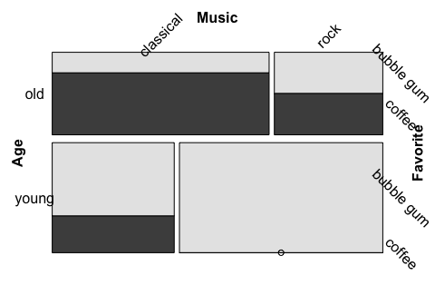

Top Ten Essential Tips for R Newbies
================
Joyce Robbins
2/15/2018

How to draw a mosaic plot with the `vcd` package
------------------------------------------------

``` r
df <- read.csv("../data/MusicIcecream.csv")
df
```

    ##     Age   Favorite     Music Freq
    ## 1   old bubble gum classical    1
    ## 2   old bubble gum      rock    1
    ## 3   old     coffee classical    3
    ## 4   old     coffee      rock    1
    ## 5 young bubble gum classical    2
    ## 6 young bubble gum      rock    5
    ## 7 young     coffee classical    1
    ## 8 young     coffee      rock    0

### Order of splits

It is best to draw mosaic plots incrementally: start with splitting on one variable and then add additional variables one at a time. The full mosaic plot will have one split per variable.

Important: if your data is in a data frame (see above), **the count column must be called `Freq`**.

Split on `Age` only:

``` r
library(vcd)
mosaic(~Age, df)
```



Split on `Age`, then `Music`:

``` r
mosaic(Music ~ Age, df)
```



Note that the *first* split is between "young" and "old", while the second set of splits divides each age group into "classical" and "rock".

Split on `Age`, then `Music`, then `Favorite`:

``` r
mosaic(Favorite ~ Age + Music, df)
```



### Direction of splits

Note that in the previous example, the direction of the splits is as follows:

1.  `Age` -- horizontal split

2.  `Music` -- vertical split

3.  `Favorite` -- horizontal split

This is the default direction pattern: alternating directions beginning with horizontal. Therefore we get the same plot with the following:

``` r
mosaic(Favorite ~ Age + Music, 
       direction = c("h", "v", "h"), df)
```


The directions can be altered as desired. For example, to create a doubledecker plot, make all splits vertical except the last one:

``` r
mosaic(Favorite ~ Age + Music,
       direction = c("v", "v", "h"), df)
```



Note that the direction vector is in order of splits (`Age`, `Music`, `Favorite`), not in the order in which the variables appear in the formula, where the last variable to be split is listed first, before the "~".

### Options

Fill color:

``` r
library(grid) # needed for gpar
mosaic(Favorite ~ Age + Music, 
       gp = gpar(fill = c("lightblue", "blue")),
       df)
```



Rotate labels:

``` r
mosaic(Favorite ~ Age + Music, 
       labeling = labeling_border(rot_labels = c(45, -45, 0, 0)),
       df)
```



The `rot_labels =` vector sets the rotation in degrees on the four sides of the plot in this order: *top, right, bottom, left*. (Different from the typical base graphics order!) The default is `rot_labels = c(0, 90, 0, 90)`.
