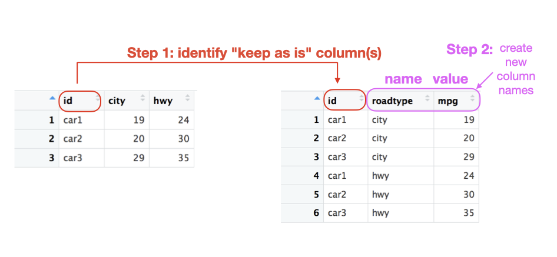
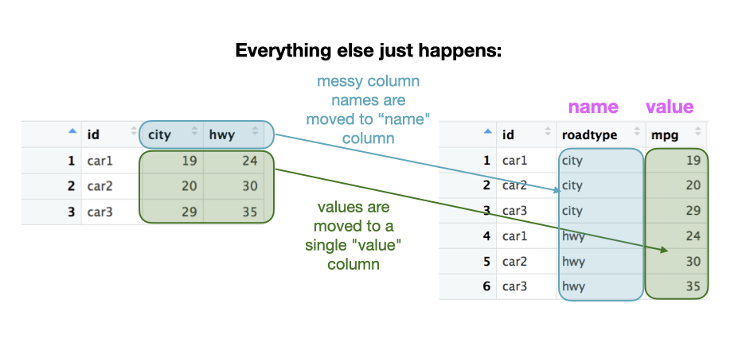
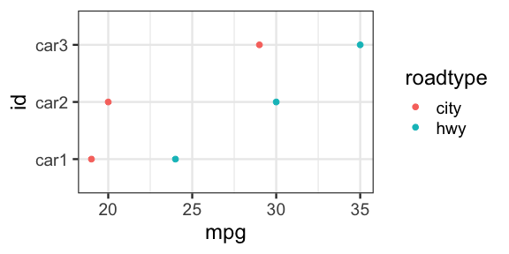

Using `tidyr::pivot_longer()` to tidy data
================
Joyce Robbins

  - [Example 1: City vs. Highway](#example-1-city-vs.-highway)
      - [Observe](#observe)
      - [Plan](#plan)
      - [Code](#code)
      - [Common problem: missing *id*
        column](#common-problem-missing-id-column)
  - [Example 2: `MASS::painters`
    dataset](#example-2-masspainters-dataset)
      - [Observe](#observe-1)
      - [Plan](#plan-1)
      - [Code](#code-1)

The [`tidyr::pivot_longer()`]() function offers substantial improvements
over its predecessor `tidyr::gather()`. This tutorial updates a previous
one I wrote on using
[`gather()`](https://github.com/jtr13/codehelp/blob/master/R/gather.md).
Most of the difficulties I observed with `gather()` have been eliminated
in `pivot_longer()`, so this tutorial will be shorter than the one it
replaces.

I also recommend reading the official [`pivot_longer()`
vignette](https://tidyr.tidyverse.org/articles/pivot.html).

`tidyr::pivot_longer()` is used to convert data from messy to tidy, or
wide to long format (shhh, you didn’t hear me say those words.) [“Tidy
Data”](https://www.jstatsoft.org/article/view/v059i10) by Hadley
Wickham, is the seminal paper on the topic, and lays out the concepts of
messy vs. tidy in detail.

## Example 1: City vs. Highway

### Observe

Before getting into the nitty-gritty of `pivot_longer()` let’s study
what our messy data looks like, and what it will look like when it’s
tidied:


Study the differences carefully. What did you observe? <br> <br> <br>
Hopefully you noticed the following:

1.  The `id` column appears in both versions, though it’s double the
    length in the tidy form.

2.  We have two new columns: `roadtype` and `mpg`.

3.  The `city` and `hwy` column names became the contents of the new
    `roadtype` (*key*) column.

4.  The *values* of the `city` and `hwy` columns became the *values* of
    the new `mpg` (*value*) column.


### Plan

Now here’s the trick: the only parts we need to concern ourselves with
are 1. and 2.: deciding which columns to keep unchanged, and what names
to give the new columns, which are called the *name* and *value*
columns.

The columns to keep are the ones that are already tidy. The ones to dump
are the ones that aren’t true variables but in fact are *levels* of
another variable. In this case, `city` and `hwy` should be levels of a
new variable called `roadtype` (or something similar), according to the
theory of tidy data. On the other hand, `id` should remain as is.

The bottom line: **keep `id` as is**



The second (and final) step is to choose names for the new *name* and
*value* columns. We’ve already chosen `roadtype` for *name*; let’s pick
`mpg` for *value*. You can also choose to stick with the defaults for
the new *name* and *value* column names: `name` and `value` (surprise).
Using `key` and `value` may be helpful at first to keep track of which
is which, though ultimately I find more descriptive names to be more
useful.

The bottom line: **names\_to = `roadtype`, values\_to = `mpg`**



### Code

The code to carry out the transformation from messy to tidy is one call
to `pivot_longer()`, with parameters that reflect our conclusions about
the columns to keep and the names we’ve chosen:

``` r
tidydata <- messydata %>% 
  pivot_longer(cols = !id, names_to = "roadtype",  values_to = "mpg")
```

The most important thing to note is that *each parameter corresponds to
one of the columns in the tidy data set.*

Now let’s look at them one at a time in more detail:

`!id` says “Don’t touch my `id` column\! Leave it as is\!”

`names_to = "roadtype"` is an instruction to *create a new name column
and call it “roadtype”.*

`values_to = "mpg"` likewise is an instruction to *create a new value
column and call it “mpg”.*

Nothing else needs to be specified: every value in a column not marked
“don’t touch” will be moved to the *value* (“mpg”) column, paired with
its old column name (in this case “city” or “hwy”) from the messy data
set, which now appears in the *name* column.

Another option is to specify the columns to pivot, rather the columns to
keep:

    ## # A tibble: 6 x 3
    ##   id    roadtype   mpg
    ##   <chr> <chr>    <dbl>
    ## 1 car1  city        19
    ## 2 car1  hwy         24
    ## 3 car2  city        20
    ## 4 car2  hwy         30
    ## 5 car3  city        29
    ## 6 car3  hwy         35

### Common problem: missing *id* column

Note in our example that the `id` column is important for linking the
city and highway miles per gallon. For example, we might want to plot
the data as follows, which requires knowing which car had which city and
highway mpg:

<!-- -->

Often, however, there is no `id` column: it’s not necessary since each
row represents one item – a car in this case. If we try to tidy messy
data without an id, it looks like this:

    ## # A tibble: 6 x 2
    ##   roadtype   mpg
    ##   <chr>    <dbl>
    ## 1 city        19
    ## 2 hwy         24
    ## 3 city        20
    ## 4 hwy         30
    ## 5 city        29
    ## 6 hwy         35

The problem is that we’ve lost the natural connection we had between
city and highway for each car since the two values no longer reside in
the same row. The solution here is to move the row names – or row
numbers in this case – to a column to be used as an id:

``` r
messydata %>% 
  select("city", "hwy") %>% 
  rownames_to_column("id") %>% 
  pivot_longer(!id, names_to = "roadtype", values_to = "mpg")
```

    ## # A tibble: 6 x 3
    ##   id    roadtype   mpg
    ##   <chr> <chr>    <dbl>
    ## 1 1     city        19
    ## 2 1     hwy         24
    ## 3 2     city        20
    ## 4 2     hwy         30
    ## 5 3     city        29
    ## 6 3     hwy         35

## Example 2: `MASS::painters` dataset

Let’s take the `painters` dataset from the **MASS** package:

    ##               Composition Drawing Colour Expression School
    ## Da Udine               10       8     16          3      A
    ## Da Vinci               15      16      4         14      A
    ## Del Piombo              8      13     16          7      A
    ## Del Sarto              12      16      9          8      A
    ## Fr. Penni               0      15      8          0      A
    ## Guilio Romano          15      16      4         14      A

…and tidy it into four columns as such:

    ## # A tibble: 6 x 4
    ##   Name     School Skill       Score
    ##   <chr>    <fct>  <chr>       <int>
    ## 1 Da Udine A      Composition    10
    ## 2 Da Udine A      Drawing         8
    ## 3 Da Udine A      Colour         16
    ## 4 Da Udine A      Expression      3
    ## 5 Da Vinci A      Composition    15
    ## 6 Da Vinci A      Drawing        16

This example is a little more complex than the previous one, since it’s
missing an *id* column, and there is more than one “keep” column. (You
are encouraged to try this on your own before looking at the solution\!)

### Observe


### Plan


  - Move rownames to a new column and call it `Name` (see “missing `id`
    column” in the **Heads up** section above to understand the need for
    this new column.)

  - Keep `Name` and `School` columns as is. (“Don’t Touch\!”)

  - Since the four columns `Composition`, `Drawing`, `Colour`, and
    `Expression` are really levels of another variable, they do not get
    the “keep” as is designation. That means we are staging them to be
    dumped into a new *key* variable which we’ll call `Skill`. In
    addition, the values contained in these columns will move to a new
    *value* column, which we’ll call `Score`.

### Code

``` r
library(MASS)
library(tidyverse)
tidypaint <- painters %>% 
  rownames_to_column("Name") %>% 
  pivot_longer(cols = !c("Name", "School"), names_to = "Skill", values_to = "Score")
```

The instructions:

“Take the (messy) dataset `painters`. Move the contents of the rownames
to a new column called `Name`. Tidy the data by a new *name* column
called `Skill` and a new *value* column called `Score`. Do not touch or
change the `Name` and `School` columns (other than to replicate as
necessary).”

The result:

The four other column names will fill the new `Skill` column, and the
values of those columns will fill the new `Score` column."

Thank you to [@angelotrivelli](https://twitter.com/angelotrivelli)
[@dch4n](https://twitter.com/@dch4n)
[@jschoeley](https://twitter.com/jschoeley)
[@jspncr\_](https://twitter.com/jspncr_)
[@kierisi](https://twitter.com/kierisi)
[@s\_lump](https://twitter.com/s_lump) for providing feedback and
helpful suggestions in response to [this Twitter
post](https://twitter.com/jtrnyc/status/958845845385940993) about my
[`gather()`
tutorial](https://github.com/jtr13/codehelp/blob/master/R/gather.md)
upon which this tutorial is based.
