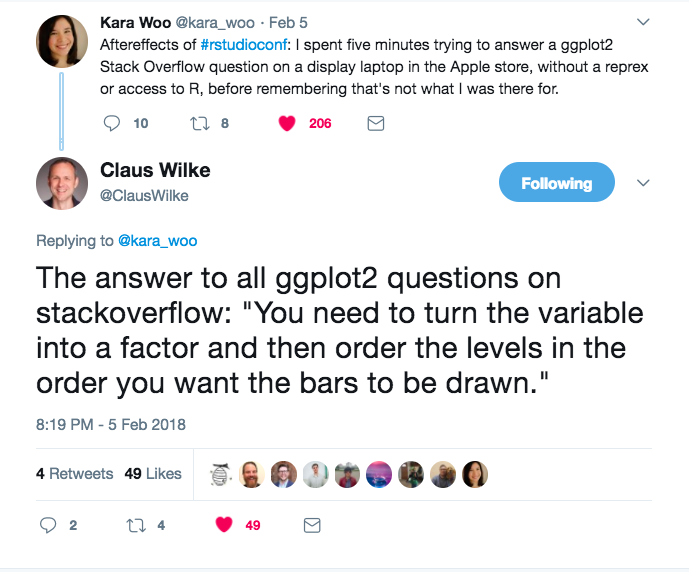
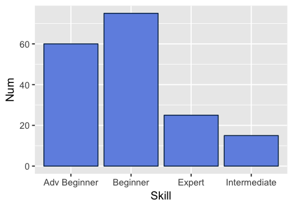
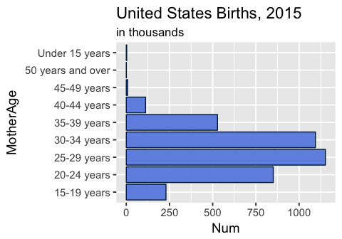
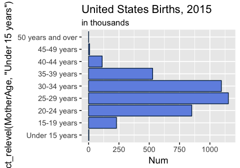
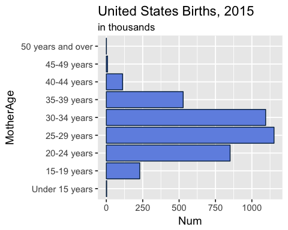
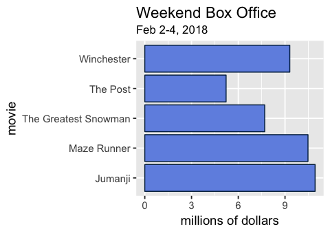
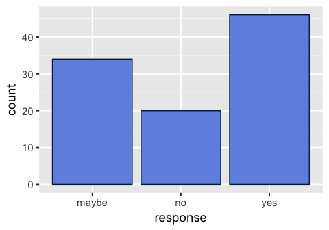
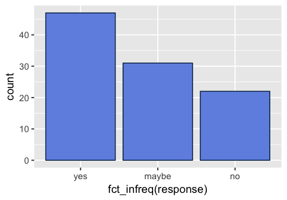

Reorder those bars, once and for all, with **forcats**
================
Joyce Robbins
2/7/2018

</img>

Since I happened to be preparing to teach, among other things, *how to reorder the bars in a bar chart* when I saw Claus Wilke's response, I figured this would be a good topic for a tutorial.

My theory is that this is a troublesome topic because several different problems are conflated into one question. If, however, you first identify *how* you want the bars ordered, and *why* they are not ordered, the road will be less rocky. And with [**forcats**](http://forcats.tidyverse.org/) (now a core [**tidyverse**](tidyverse.org) package) functions -- namely, `fct_inorder()`, `fct_relevel()`, `fct_reorder()`, and `fct_infreq()` -- it will become second nature to get the order of the bars right.

In the examples below, all of the reordering happens in the calls to `ggplot2` -- you don't have to change the data at all. In fact, you don't even have to have factor data. The **forcats** functions will convert character data to factor for plotting purposes only. However, if you prefer to change the data itself, of course, you can. See the U.S. births example below for an example on how to do so.

There are two key rules to follow when deciding how to reorder bars in a bar chart:

### 1. Bars should appear in their natural order, if they have one.

If the levels or categories have a natural order to them (a.k.a. ordinal data), they should be plotted in that order. However, unless specified otherwise, whether your categories are stored as factor or character data, they will appear in alphabetical order in a bar chart (unless you changed around the levels of the factors).

In this example, the levels have a natural order, from Beginner to Expert, that is not reflected in the plot:

``` r
library(tidyverse)
mycolor <- "#002448"; myfill = "#7192E3"

mydf <- tibble(Skill = c("Beginner", "Adv Beginner", "Intermediate", "Expert"),
               Num = c(75, 60, 15, 25))

ggplot(mydf, aes(Skill, Num)) + 
  geom_col(color = mycolor, fill = myfill) + theme_grey(14)
```



The simplest way to get the order right depends on the situation at hand:

#### (a) The row order is correct

In this case, we can simply indicate with `fct_inorder()` that we want the levels to be plotted in the order in which they appear in the data frame:

``` r
mydf
```

    ## # A tibble: 4 x 2
    ##   Skill          Num
    ##   <chr>        <dbl>
    ## 1 Beginner      75.0
    ## 2 Adv Beginner  60.0
    ## 3 Intermediate  15.0
    ## 4 Expert        25.0

Since the row order in the data frame is correct, it's a simple fix:

``` r
ggplot(mydf, aes(fct_inorder(Skill), Num)) + 
  geom_col(color = mycolor, fill = myfill) + theme_grey(14)
```


#### (b) Only one category is out of order

Often there's just one level out of order. In the case below it's "Under 15 years", which should be the first category in the chart, not the last:

``` r
# 2015 U.S. Births
MotherAge <-  c("15-19 years", "20-24 years", "25-29 years", 
                "30-34 years", "35-39 years", "40-44 years",
                "45-49 years", "50 years and over", "Under 15 years")

Num <- c(229.715, 850.509, 1152.311, 1094.693, 527.996, 111.848,
            8.171, .754, 2.500)

Births2015 <- tibble(MotherAge, Num)

ggplot(Births2015, aes(MotherAge, Num)) + 
  geom_col(color = mycolor, fill = myfill) + 
  ggtitle("United States Births, 2015", subtitle = "in thousands") +
  scale_y_continuous(breaks = seq(0, 1250, 250)) +
  coord_flip() + theme_grey(14)
```



We can use `fct_relevel()` to move it where it needs to go:

``` r
ggplot(Births2015, aes(fct_relevel(MotherAge, "Under 15 years"), Num)) + 
  ggtitle("United States Births, 2015", subtitle = "in thousands") +
  scale_y_continuous(breaks = seq(0, 1250, 250)) +
  geom_col(color = mycolor, fill = myfill) + coord_flip() + theme_grey(14)
```



Although we can move the levels around without touching the original data, in this case, we probably do want to change the levels to the correct natural order and then plot, as follows:

``` r
Births2015 <- Births2015 %>%
  mutate(MotherAge = fct_relevel(MotherAge, "Under 15 years"))

ggplot(Births2015, aes(MotherAge, Num)) + 
  ggtitle("United States Births, 2015", subtitle = "in thousands") +
  scale_y_continuous(breaks = seq(0, 1250, 250)) +
  geom_col(color = mycolor, fill = myfill) + coord_flip() + theme_grey(14)
```



#### (c) Many categories are out of order

As long as the categories that are out of order all need to be moved to the same place, we can use the same technique:

``` r
x <- factor(c("A", "B", "C", "move1", "D", "E", "move2", "F"))
x
```

    ## [1] A     B     C     move1 D     E     move2 F    
    ## Levels: A B C D E F move1 move2

``` r
fct_relevel(x, "move1", "move2")   # move to the beginning (default)
```

    ## [1] A     B     C     move1 D     E     move2 F    
    ## Levels: move1 move2 A B C D E F

``` r
fct_relevel(x, "move1", "move2", after = 4) # move after the fourth item
```

    ## [1] A     B     C     move1 D     E     move2 F    
    ## Levels: A B C D move1 move2 E F

``` r
fct_relevel(x, "move1", "move2", after = Inf) # move to the end
```

    ## [1] A     B     C     move1 D     E     move2 F    
    ## Levels: A B C D E F move1 move2

However, if they're all in a big jumble, the only solution is to manually reorder all of the levels with `fct_relevel()`.

Some important notes:

-   This problem has nothing to do with any other variable. There is simply a mismatch between the levels of the factors and the natural order of the categories.

-   Don't be tempted to use ordered factors even though your data has ordered levels. The levels are ordered for *all* factors.

### 2. Otherwise, bars should be ordered by frequency count.

Ordering by frequency count is the recommended approach for nominal data, that is, categories that are not naturally ordered.

#### (a) Using `geom_col()`

Once again, the default is for the bars to be ordered alphabetically, which is not what we want. (Since the bar chart is horizontal the categories are alphabetical from bottom to top.)

``` r
weekend_gross <- tibble(movie = c("Jumanji", "Maze Runner", "Winchester",
                        "The Greatest Snowman", "The Post"),
              gross = c(10.93, 10.475, 9.307, 7.696, 5.218))

ggplot(weekend_gross, aes(movie, gross)) + 
  ggtitle("Weekend Box Office", subtitle = "Feb 2-4, 2018") + 
  ylab("millions of dollars") +
  geom_col(color = mycolor, fill = myfill) + coord_flip() + theme_grey(14)
```



This issue can be addressed within the call to `ggplot()` with `fct_reorder()`, also from **forcats**; we do not have to actually reorder the factor levels.

``` r
# note the change in the first line:
ggplot(weekend_gross, aes(fct_reorder(movie, gross), gross)) +  
  ggtitle("Weekend Box Office", subtitle = "Feb 2-4, 2018") + 
  ylab("millions of dollars") +
  geom_col(color = mycolor, fill = myfill) + coord_flip() + theme_grey(14)
```


Notes:

-   Although it appears that the bars are ordered from highest to lowest frequency count, in fact, they are ordered from lowest to highest, and plotted from the bottom up in a horizontal bar chart. If you need to reverse the order, you can add a minus sign to the variable which determines the order: `fct_reorder(movie, -gross)` or use `fct_reorder(movie, gross) %>% fct_rev()`.

#### (b) Using `geom_bar()` -- data is unbinned

In this case, we can't order by another variable since we only have one variable: a list of categories:

``` r
unbinned <- tibble(response = sample(c("yes", "no", "maybe"), 100, 
                                     replace = TRUE, prob = c(.5, .15, .35)))

ggplot(unbinned, aes(response)) + geom_bar(color = mycolor, fill = myfill) +
  theme_grey(14)
```



Again the bars are ordered alphabetically by default, not in order of frequency. The solution is our fourth **forcats** function, `fct_infreq()`:

``` r
ggplot(unbinned, aes(fct_infreq(response))) + geom_bar(color = mycolor, fill = myfill) +
  theme_grey(14)
```



Note that `fct_infreq()` orders the levels in *decreasing* order of frequency, ideal for drawing bar charts (presumably not a coincidence).

*Many thanks to Emily Zabor ( [@zabormetrics](https://twitter.com/zabormetrics)) for convincing me to try `forcats` despite my initial reluctance.*

For more on best practices for bar charts, see:

Antony Unwin, "Displaying Categorical Data," *Graphical Data Analysis with R* (CRC Press: 2015).

For more detail on **forcats** functions in general, see:

Jenny Bryan, ["Be the boss of your factors"](http://stat545.com/block029_factors.html)

Garrett Grolemund and Hadley Wickham, ["Factors" chapter](http://r4ds.had.co.nz/factors.html) in *R for Data Science*
